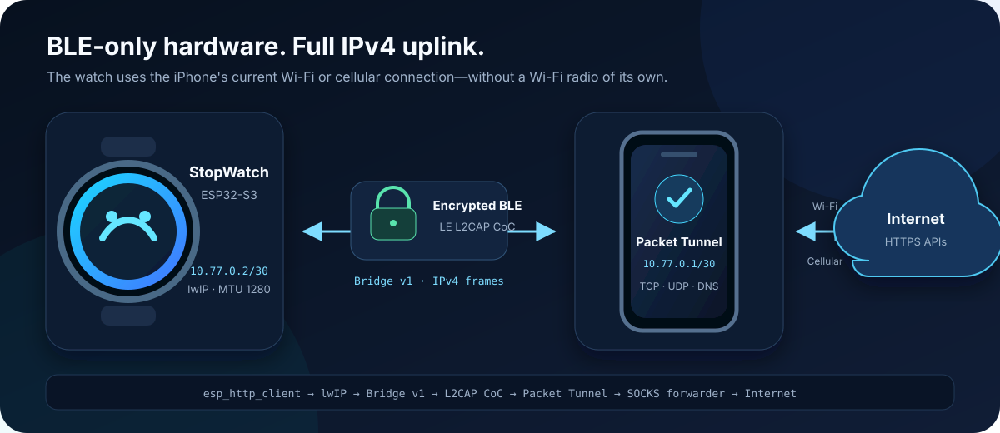

<div align="center">

# Bajji

**让只有 BLE 的 M5Stack StopWatch 通过 iPhone 获得 IPv4 网络与壁纸体验。**

[English](README.md) · [**简体中文**](README_zh.md)


</div>



Bajji 让 [M5Stack StopWatch](https://docs.m5stack.com/en/core/StopWatch) 通过 iPhone 访问互联网。手表没有 Wi-Fi 射频：ESP32-S3 固件把 IPv4 包承载在加密的 BLE LE credit-based L2CAP 通道上，iOS Packet Tunnel 再把 TCP、UDP 和 DNS 流量转发到手机当前的 Wi-Fi 或蜂窝网络。

端到端演示直接运行在手表上：它与一台 iPhone 安全配对，通过 HTTPS 下载随机壁纸，在本地缓存，并在圆形 AMOLED 上显示静态或动态图片。

> [!IMPORTANT]
> Bajji 是实验性硬件工程。iOS 网桥需要运行 iOS 26 的真机，并使用带 Packet Tunnel 与 App Group entitlement 的开发者签名；当前不提供 App Store 或 TestFlight 分发。

## 亮点

- **无需 Wi-Fi 配网** —— StopWatch 直接把已有的 BLE 射频用作点对点 IPv4 链路。
- **安全的一对一配对** —— LE Secure Connections、手表显示六位配对码、持久化 Bond，以及显式清除绑定。
- **够用的网络语义** —— 支持 IPv4、TCP、UDP 和 DNS；1280-byte MTU 避免网桥链路上的分片。
- **圆屏产品 UI** —— 在设备端完成配对、壁纸分类设置、Cover 与 Fit+Blur 模式切换，并同时支持触摸与 A/B 实体键。
- **可靠的媒体链路** —— 支持 JPEG、PNG、GIF、静态 WebP 和动画 WebP，包含格式校验、大小限制、原子缓存替换与离线回退。
- **共用线协议约束** —— C 与 Swift 实现使用同一份 [Bridge v1 测试向量](protocol/vectors/bridge-v1.json)验证。

## 壁纸体验

<p align="center">
  
</p>
<p align="center"><em>仓库内置的显示调试示例；设备会通过 BLE 网桥获取新图片。</em></p>

在图片页中，**KEY A** 切换 Cover 与 Fit+Blur，**KEY B** 请求下一张壁纸，同时按住 **A+B** 一秒返回设置。重启或网桥断开后，最后一张有效图片仍可离线显示。

## 工作原理

1. StopWatch 创建地址为 `10.77.0.2/30` 的点对点 lwIP 网卡。
2. [Bridge v1](protocol/bridge-v1.md) 把完整 IPv4 包封装到加密的 LE L2CAP CoC 上。
3. Packet Tunnel 扩展独占 CoreBluetooth，并在手机侧提供 `10.77.0.1/30` 网关。
4. UNIX datagram pipe 把数据包交给固定版本的 HEV tunnel 与本机 loopback SOCKS forwarder。
5. Forwarder 通过 iPhone 当前网络建立 TCP/UDP 外连，再把重建的 IPv4 响应包送回手表。

Packet Tunnel 只安装 `10.77.0.0/30` 路由。Bajji 不替换 iPhone 的默认路由，也不代理手机自身的流量。

## 硬件与工具链

| 项目 | 工程目标 |
|---|---|
| 手表 | M5Stack StopWatch |
| SoC | ESP32-S3R8，240 MHz |
| 存储 | 16 MB Flash，8 MB OPI PSRAM |
| 屏幕 | 圆形 CO5300 AMOLED，468×468 面板 |
| 设备 SDK | ESP-IDF 6.0、LVGL 9.5 |
| 手机 | 运行 iOS 26 的 iPhone 真机 |
| iOS 工具链 | Xcode 26、Swift 6 |

除屏幕外，其他器件共用系统 I²C 总线。硬件说明、原理图与完整 PinMap 位于 [`docs/hardware`](docs/hardware/description.md)。

## 快速开始

### 1. 构建并烧写固件

安装并导出 ESP-IDF 6.0，确认 `idf.py` 已加入 `PATH`，然后执行：

```sh
cd device
python3 tools/fetch_deps.py
idf.py build
idf.py -p <PORT> flash monitor
```

`fetch_deps.py` 会把固定版本的源码检出到生成目录 `device/vendor/`，并应用仓库内补丁。上述烧写命令会同时写入 bootloader、分区表和应用。

### 2. 构建 iOS 网桥

在安装了 Xcode 26 的 macOS 上执行：

```sh
python3 ios/tools/fetch_forwarder_deps.py
open ios/Bajji.xcodeproj
```

在 `ios/Config/` 中配置自己的开发者 Team、唯一 Bundle ID 与匹配的 App Group。在 Xcode 中选择 **BajjiBridge** scheme，并运行到 iPhone 真机；Simulator 无法提供所需的 BLE 与 Packet Tunnel 数据路径。

### 3. 配对并连接

1. 启动已经烧写固件的 StopWatch。
2. 在 iOS App 中依次点击 **Install VPN Profile** 和 **Start Bridge**。
3. iOS 弹窗出现后，输入手表显示的六位配对码。
4. 在手表上选择壁纸分类并保存；网桥与时间同步就绪后会开始第一次 HTTPS 请求。

测试生命周期时，请先断开 Xcode 调试器再划掉宿主 App；停止 Xcode 调试会同时终止扩展。

## 测试

以下快速检查不需要 StopWatch 真机：

```sh
bash device/tests/host/run.sh
swift test --package-path ios
xcodebuild -project ios/Bajji.xcodeproj -scheme BajjiBridge \
  -configuration Debug -sdk iphoneos -destination 'generic/platform=iOS' \
  CODE_SIGNING_ALLOWED=NO build
```

配对、吞吐、锁屏、重连、网络切换、缓存与稳定性实测请使用[完整 IP 网桥真机验证模板](docs/validation/complete-ip-bridge-template.md)。

## 仓库结构

| 路径 | 用途 |
|---|---|
| [`device/`](device/) | ESP-IDF 固件、board HAL、LVGL UI、BLE 链路、lwIP 网桥和壁纸管线 |
| [`ios/`](ios/) | SwiftUI 宿主 App、Packet Tunnel、共用 Bridge codec、测试和固定版本的 forwarder 构建脚本 |
| [`protocol/`](protocol/) | Bridge v1 规范与跨语言测试向量 |
| [`docs/`](docs/) | 硬件资料、验证模板、设计规格和图片 |
| [`wiki/`](wiki/README.md) | 已实测的工程经验与平台行为 |

## 当前边界

- 仅支持 IPv4；不支持 IPv6、ICMP 和 IP 分片/重组。
- 一台 iPhone 与一块 StopWatch 绑定；不支持多设备或并发网桥。
- Packet Tunnel 作为 BLE 网桥后台宿主属于实验性用法，需要持续进行 iOS 真机生命周期验证。
- 手表刻意不提供 Wi-Fi 路径、账号、收藏、历史记录或定时换图。

线协议以 [`protocol/bridge-v1.md`](protocol/bridge-v1.md) 为准；iOS 专用的配置与生命周期说明见 [`ios/README.md`](ios/README.md)。
