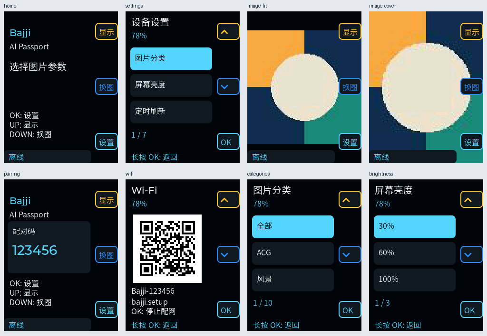

# FoloToy AI Passport

AI Passport is selected at build time; StopWatch remains the default board. This port
uses the shared BLE/IP bridge, network settings, captive portal, wallpaper storage and
phone protocol, with a separate HAL and 240x320 portrait UI.

## Hardware and controls

Hardware source: [FoloToy AI Passport](https://github.com/FoloToy/ai-passport), pinned to
`33d3d1d93a1125b356b47b6d83a7a60121be801e` in `device/deps.lock.json`.
Display, shared I2C, CW2017 and ES8311 implementations are compiled from that dependency;
its `components/bsp/include/bsp_pins.h` is the pin and ADC-window source of truth.
The upstream MIT license remains in the fetched dependency. No demo UI is copied.

| Item | AI Passport |
|---|---|
| MCU / storage | ESP32-C3, 8 MB flash, no PSRAM |
| Display | ST7789P3, 240x320 portrait, SPI, small 20-line DMA buffer |
| Console | Native USB Serial/JTAG; UART TX would conflict with backlight GPIO21 |
| Battery | CW2017 SOC and voltage; unavailable readings show `--%` |
| Input | UP / DOWN / OK, ADC resistor ladder on GPIO0, calibrated samples |
| Unsupported board features | Touch, IMU rotation, vibration, software power latch |

With the display upright, action hints follow the three function keys down the **right
edge**, rather than the two controls across the top of StopWatch. Yellow and blue retain
the original display/refresh action identities.

| Physical key | Wallpaper/home | Settings |
|---|---|---|
| UP (upper right) | Toggle cover / fit | Previous row |
| DOWN (middle right) | Refresh image | Next row |
| OK (lower right), release | Open settings | Select highlighted row |
| OK, hold 700 ms | Cancel active loading, otherwise settings | Back |

The ADC ladder cannot reliably report simultaneous keys. There is no two-button hold
shortcut. Single actions fire on release; OK hold fires once and suppresses its release.
A transition between different keys without release cancels that gesture. The separate
hardware power button remains responsible for power-off.

Settings use three visible rows per page. Categories/types, brightness, auto-refresh
(0 or 1–1440 minutes), Wi-Fi portal and confirmed unpairing are accessible without touch.
Pairing interrupts the current page to show the six-digit code. The QR portal fits within
the portrait content column. Fit mode uses a plain background.



## Memory and media

BridgeInfo bit `0x80` advertises the compact static-JPEG profile, combined with the existing
capabilities (`0xff` on Passport, `0x7f` on StopWatch). Frame layout, IDs, security and MTU
remain Bridge v1. See [the wire contract](../protocol/bridge-v1.md).

Passport accepts baseline JPEG only, at most 64 KiB, with positive dimensions no larger
than 160 per axis and at most 19,200 pixels. The proxy produces at most 120x160 pixels;
the iPhone preserves the edited crop within the same bounding box. Display rendering
scales that image onto the 240x320 panel. PNG, animated GIF/WebP and the full-screen blur
are intentionally unavailable on this memory profile. The updated phone app explains
that video/GIF sends a static preview frame, saves the bytes actually sent in history,
and recognizes JPEG history for later resending. Old phone versions receive an unsupported
format response and cannot replace the cache with unsupported media.

Only one <=40 KiB RGB565 image is retained, and it is released before loading or entering
settings. The existing CRC, exact byte count and atomic cache replacement checks apply.
The C3 profile reduces Wi-Fi buffers and BLE TX queue size and moves optional Wi-Fi fast
paths out of IRAM. Audio initializes lazily. Allocation errors are handled, but free heap,
largest block and coexistence under load still need device measurements.

The Worker now contains `/passport-cover` and `/passport-fit` static-JPEG variants.
**These routes must be deployed before random-image downloads work with this firmware.**
This change does not deploy the shared production Worker. Existing `/cover` and `/fit`
transforms remain unchanged. Phone-to-device JPEG transfer does not require the Worker.

## Build and firmware

Use ESP-IDF 6.0 with both `esp32c3` and `esp32s3` tools installed:

```sh
cd device
python3 tools/fetch_deps.py
idf.py -B build-ai-passport -D BAJJI_BOARD=ai_passport build
# Regression build for the original board:
idf.py -B build-stopwatch -D BAJJI_BOARD=stopwatch build
```

Passport has its own generated `sdkconfig.ai_passport`, defaults, dependency lock, build
directory and partition table. Its factory app is 4 MiB and wallpaper FAT is 4032 KiB.
Do not use a StopWatch image or partition table on Passport. Firmware updates must include
the matching bootloader and partition table, not only the application. Changing partition
layouts can reformat the local wallpaper cache.

To generate a merged image from the Passport build (without flashing):

```sh
cd build-ai-passport
python -m esptool --chip esp32c3 merge-bin -o full.bin \
  --flash-mode dio --flash-size 8MB --flash-freq 80m \
  0x0 bootloader/bootloader.bin 0x8000 partition_table/partition-table.bin \
  0x10000 bajji_ai_passport.bin
```

`full.bin` is for offset `0x0`. Use the physical power/USB procedure from the upstream
hardware guide. This port has not been flashed or accepted on real hardware yet.

## Validation

Verified in this checkout:

- ESP-IDF 6.0 Passport and StopWatch full builds.
- Device host tests, including ladder debounce/hold suppression, JPEG budget and proxy URLs.
- Real-LVGL desktop navigation, glyph/bounds checks, JPEG decode and cover/fit captures.
- Four Worker tests, including both JPEG transformations and existing WebP routes.
- Swift package: 14 tests passed.
- iPhoneOS `build-for-testing`: app, extensions and renderer tests compile successfully.

Full iOS Simulator tests cannot run because the existing WiFiSharingExtension imports
`WiFiInfrastructure`, which is absent from the simulator SDK. The UIKit renderer tests
are compiled for iPhoneOS but have not executed. No AI Passport serial device was connected.

On-device acceptance:

1. Cold boot over USB and battery: upright colors, complete edges, stable backlight and SOC.
2. Press/release each key and measure ADC millivolts; verify all three right-side hints match.
   Test bounce, rapid taps, OK hold, release suppression and invalid simultaneous presses.
3. Pair from iPhone, including from a settings page; verify the code and reconnect after reboot.
4. Use the QR portal, manual/shared Wi-Fi and VPN/control-only CoC; verify radio coexistence.
5. Send PNG/video/GIF from the updated app: confirm the static JPEG warning, actual image,
   history and resend. Test cancellation, malformed/oversized images and power-loss recovery.
6. After Worker deployment, test both random-image modes, auto-refresh and offline cache.
7. Measure free heap, largest free block and task stack watermarks during HTTPS, CoC transfer,
   redraw, portal and reconnection; soak-test repeated image swaps with both radios active.
