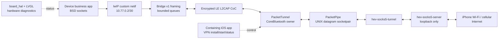

# Bajji StopWatch BLE IP Bridge 设计规格

- 日期：2026-08-19
- 状态：已批准
- Device：M5Stack StopWatch（ESP32-S3R8）
- Device SDK：本机 ESP-IDF v6.0
- iOS：iOS 26，开发者签名真机安装

## 1. 目标

本项目首先建立可独立验证的 StopWatch 基础工程，再建立一条无需 Wi-Fi 配网的蓝牙网络链路：

1. Device 使用 LVGL 提供基础硬件诊断界面，并支持开关机、电源、AMOLED、触摸、按键、振动、扬声器、麦克风、IMU 和 RTC。
2. Device 把 lwIP 产生的原始 IPv4 包封装到 BLE LE L2CAP CoC 中。
3. iOS 端接收这些包，在用户态转换成 iPhone 的 TCP/UDP 外连，并把响应重建为 IPv4 包送回 Device。
4. iOS 首选在 `NEPacketTunnelProvider` 中持有蓝牙与转发数据面，使前台、后台和锁屏状态都可工作。
5. 首版持续单向有效载荷吞吐必须大于 50 KB/s。

“透明网络”仅指 Device 上使用标准 lwIP socket API 的应用无需感知蓝牙代理。它不表示转发 iPhone 自身流量。

## 2. 首版范围

首版支持：

- IPv4；
- TCP；
- UDP，包括普通 DNS UDP 请求；
- 一台 iPhone 与一台 StopWatch 的持久化绑定；
- BLE Secure Connections；
- 连接参数请求、协商结果记录和链路统计；
- iOS 当前 Wi-Fi 或蜂窝网络作为出口；
- 断线、蓝牙关闭和 iOS 网络切换后的自动恢复。

首版不支持：

- IPv6；
- ICMP，因此不承诺 `ping`；
- IP 分片或重组；
- 多 iPhone、多 StopWatch 或并发桥接；
- TestFlight/App Store 发布与审核；
- iPhone 自身流量代理；
- 上层业务功能与正式业务 UI。

### 2.1 分阶段交付

本规格是总架构，实施时拆成四个可独立验收的小阶段，并分别编写实施计划：

1. StopWatch 硬件基础与 LVGL 诊断 UI；
2. Bridge v1 协议、Device lwIP netif 与 L2CAP 回环；
3. iOS Packet Tunnel 的 Phase 0 真机可行性验证；
4. TCP/UDP/DNS 完整转发与端到端验收。

第 3 阶段是第 4 阶段的硬门槛；失败时按第 12 节切换后台宿主，不扩散修改 Device 和线协议。

## 3. 已知平台约束

ESP32-S3 会请求 2M PHY、15 ms 连接间隔、0 peripheral latency 和 4 s supervision timeout，并记录实际协商值。iOS 是连接中央设备，公开 API 不允许应用强制 PHY；Apple 也明确指出 15 ms 请求可能被调整为 30 ms。因此 2M/15 ms 是“请求并观测”，不是硬性验收结果。

Apple 将 Packet Tunnel 的预期用途定义为把 iOS 捕获的包送入远端网络，并明确不建议用 Packet Tunnel 承载通用代理服务。本设计将 Packet Tunnel 用作 BLE 网桥后台宿主，并在内部运行 loopback SOCKS 服务，属于实验性、非 Apple 支持的用途。必须先通过第 12 节的 Phase 0 真机门槛，才能继续完整网桥实现。

若 Phase 0 失败，BLE 与 Forwarder 移入包含应用，使用 iOS 26 CoreBluetooth 后台模式与 Live Activity。Device 固件、线协议、PacketPipe 和 Forwarder 内核保持不变。

## 4. 总体架构



### 数据面所有权

- Device `ip_bridge` 独占 lwIP netif 与 IP 队列。
- Device `ble_link` 独占 GATT、bond 和 L2CAP CoC。
- iOS Packet Tunnel 是唯一 `CBCentralManager`、`CBPeripheral` 和 `CBL2CAPChannel` owner。
- iOS 主 App 不传递活动蓝牙对象，只通过 `NETunnelProviderSession` 交换命令与状态快照。
- App Group 仅保存已绑定 Device ID、用户设置和最后状态；不共享活动连接状态。

## 5. 仓库结构

```text
.
├── .gitignore
├── README.md
├── device/
│   ├── CMakeLists.txt
│   ├── sdkconfig.defaults
│   ├── partitions.csv
│   ├── main/
│   └── components/
│       ├── board_hal/
│       ├── ui/
│       ├── ble_link/
│       └── ip_bridge/
├── ios/
│   ├── Bajji.xcodeproj/
│   ├── BajjiApp/
│   ├── PacketTunnel/
│   ├── Shared/
│   ├── Forwarder/
│   └── BajjiTests/
├── protocol/
│   ├── bridge-v1.md
│   └── vectors/bridge-v1.json
└── docs/
    ├── hardware/
    └── superpowers/specs/
```

`protocol/bridge-v1.md` 是线协议的唯一规范。C 和 Swift 各自保留小型编解码实现，并共同验证 `bridge-v1.json`；首版不引入代码生成器。

## 6. Device 基础工程

### 6.1 依赖策略

工程使用本机 ESP-IDF v6.0。M5Stack 官方 `M5StopWatch-UserDemo` 仅作为已验证硬件初始化顺序和 HAL 实现参考，不复制其闹钟、表盘、转盘等业务应用。

起始依赖与官方 Demo 对齐：

- LVGL 9.5.0；
- M5GFX 0.2.19；
- M5IOE1 1.0.8；
- M5PM1 1.0.6；
- BMI270/BMM150 Sensor 0.1.2；
- ESP-IDF 自带 lwIP 与 Bluedroid。

所有 Git 依赖必须锁定到确切提交，构建不能跟随浮动分支。复用代码保留原 MIT 版权与 SPDX 标头。ESP-IDF 5.5.4 到 6.0 的兼容改动局限在依赖补丁或 `board_hal`，不向 UI 和网络层泄漏。

### 6.2 启动顺序

Device 按以下顺序初始化：

1. NVS；若遇到页不足或版本变化，擦除后重试一次；
2. I2C（GPIO47 SDA、GPIO48 SCL）；
3. M5PM1；
4. M5IOE1 与外设电源轨；
5. CO5300 AMOLED 与 CST820B 触摸；
6. LVGL；
7. ES8311、AW8737A、麦克风与振动马达；
8. BMI270、RX8130CE 与物理按键；
9. BLE 与 Bridge 服务。

非关键外设初始化失败时继续启动，并在诊断 UI 中标红。显示失败时仍保留 USB 串口日志。PMIC、IO expander、电源轨、reset、睡眠和 shutdown 只允许通过 `board_hal` 操作。

### 6.3 HAL 范围

`board_hal` 提供最小、直接的功能接口：

- 电池电压、充电状态、软件 shutdown、睡眠与电源键唤醒；
- AMOLED 初始化、亮度和 LVGL flush；
- 触摸 reset、坐标读取和 LVGL input；
- 两个可编程按键事件；
- M5IOE1 PWM 振动强度与时长；
- 扬声器 tone、麦克风电平采样；
- IMU 加速度/角速度读取；
- RTC 日期时间读取与设置。

首版不为每个 HAL 建立单实现接口或工厂类。

### 6.4 LVGL 诊断 UI

基础 UI 只包含可滚动诊断页：

- Power：电量、充电、关机、睡眠与唤醒；
- Display & Touch：颜色、亮度和触点坐标；
- Buttons & Motor：按键事件和一次振动；
- Audio：扬声器 tone 与麦克风电平；
- IMU & RTC：传感器数据与时间；
- BLE：绑定、RSSI、请求/实际 PHY、请求/实际连接间隔；
- Bridge：Waiting/Connecting/Online、IP、瞬时速率、包数、丢包和最后错误；
- Security：配对 Passkey 与显式清除绑定。

## 7. Device 网络与 BLE

### 7.1 lwIP netif

`ip_bridge` 创建一个 point-to-point custom netif：

- Device：`10.77.0.2/30`；
- user-space gateway：`10.77.0.1`；
- MTU：1280 bytes；
- 默认 DNS：`1.1.1.1`，作为普通 UDP 流量转发；
- L2CAP HELLO 成功后 `netif_set_link_up`；
- CoC 断开时立即 `netif_set_link_down`。

Device 不运行 DHCP，也不保存 Wi-Fi 配置。MTU 防止 TCP 产生需要 IP 分片的包。超出 MTU 的 UDP 数据报返回发送错误；收到带 fragment offset 或 MF 标志的 IPv4 包直接丢弃并计数。

### 7.2 BLE 角色与参数

StopWatch 是 BLE peripheral，iPhone 是 central。Device 广播固定的 128-bit Bajji Bridge Service UUID；iOS 后台扫描必须使用该 UUID 过滤。

连接成功后 Device 请求：

- TX/RX PHY：2M preferred；
- connection interval min/max：15 ms；
- peripheral latency：0；
- supervision timeout：4 s；
- Data Length Extension 与控制器允许的最大数据长度。

实际 PHY、interval、MTU/MPS 和 RSSI写入日志与状态 UI。实际 interval 为 30 ms 或 PHY 为 1M 时不判定失败；只有吞吐未达到 50 KB/s 才失败。

## 8. 绑定、GATT 与 CoC 建立

### 8.1 一对一安全绑定

Device 首次启动生成并在 NVS 保存一个随机 128-bit Device ID。尚未绑定时，访问 BridgeInfo characteristic 触发 LE Secure Connections passkey pairing：StopWatch 显示六位 Passkey，用户在 iPhone 系统弹窗中输入。成功后 Device 保存 bond，并只接受该 peer。

重新绑定必须从 Device 的 Security 页面显式执行“清除绑定”。此操作删除 bond、生成新的配对窗口并断开当前连接；远端不能静默替换已绑定 iPhone。

### 8.2 BridgeInfo characteristic

加密读取的 BridgeInfo 固定为 22 bytes：

| Offset | Size | Field |
|---:|---:|---|
| 0 | 1 | protocol version，首版为 1 |
| 1 | 1 | capabilities：bit0 IPv4、bit1 TCP、bit2 UDP |
| 2 | 2 | LE_PSM，big-endian |
| 4 | 2 | max frame payload，big-endian，首版为 1280 |
| 6 | 16 | Device ID |

iOS 校验版本、能力和已绑定 Device ID 后，使用读取到的 PSM 打开 L2CAP CoC。CoC MTU 配置不小于 1536 bytes。

## 9. Bridge v1 帧协议

iOS 的 `CBL2CAPChannel` 暴露 byte stream，因此协议不能依赖一次 read 对应一个 L2CAP SDU。解析器必须处理 partial read、coalesced read 和 magic 重同步。

固定 8-byte header：

| Offset | Size | Field |
|---:|---:|---|
| 0 | 2 | magic：`BA 77` |
| 2 | 1 | version：`01` |
| 3 | 1 | type |
| 4 | 2 | payload length，big-endian |
| 6 | 2 | sequence，big-endian，modulo 65536 |

Frame type：

- `0x01 HELLO`：16-byte Device ID、2-byte MTU、4-byte session nonce；
- `0x02 HELLO_ACK`：2-byte accepted MTU、4-byte echoed nonce、1-byte status；
- `0x10 IPV4`：完整 IPv4 packet，最大 1280 bytes；
- `0x20 PING`：8-byte monotonic timestamp；
- `0x21 PONG`：原样回显 timestamp；
- `0x7F ERROR`：2-byte error code。

除 IPV4 外的 frame 最大 payload 为 64 bytes。未知版本、未知 type、非法长度或错误 magic 会增加协议错误计数并关闭 CoC。BLE 已提供有序可靠传输与链路 CRC，首版不重复添加 payload CRC。Sequence 仅用于诊断丢帧和重连边界，不用于重传。

两端每个方向最多排队 32 个完整 frame。写端不可用时停止上游读取；无法施加背压的入口在队列满时丢弃整个最新 IPv4 frame 并计数，绝不保留半帧。

## 10. iOS 工程

### 10.1 BajjiApp

SwiftUI 主 App 负责：

- 请求蓝牙权限；
- 创建、保存和启停 `NETunnelProviderManager` 配置；
- 显示 VPN 与 Bridge 的独立状态；
- 传递目标 Device ID 和用户操作；
- 展示扩展返回的统计快照与最后错误。

主 App 不持有活动 BLE 连接。首版只要求开发者账号签名真机运行，不包含发布流程。

### 10.2 PacketTunnel

`startTunnel` 设置仅包含 `10.77.0.0/30` 的窄 IPv4 route，不安装 default route，也不设置 `includeAllNetworks`，因此 iPhone 普通流量不进入 `packetFlow`。设置完成后扩展进入 Waiting 状态并启动 `CBCentralManager`。

Packet Tunnel 负责：

- 定向扫描 Bridge Service UUID；
- 只连接已绑定 Device ID；
- GATT BridgeInfo 读取、CoC 打开和 HELLO；
- L2CAP stream 编解码与背压；
- PacketPipe 与 HEV Forwarder 生命周期；
- 自动重连、路径变化和状态上报。

### 10.3 Forwarder

不自研 TCP 状态机。Forwarder 锁定以下 MIT 依赖：

- `hev-socks5-tunnel` commit `0428c4ebb0df933ebac8e507832f252ef7da47f1`；
- `hev-socks5-server` commit `b6e41fe7c1a30aa5b8ac425233d3c95cd618a214`。

数据路径：

1. PacketPipe 创建 UNIX datagram `socketpair`，保持一包一次 read/write；
2. L2CAP IPV4 payload 加 4-byte address-family prefix 后写入 pipe；
3. `hev-socks5-tunnel` 从另一端读取，并连接仅监听 loopback 的 `hev-socks5-server`；
4. server 使用 iPhone 当前默认网络建立 TCP/UDP 外连；
5. 响应包从 pipe 读出，去掉 address-family prefix 后封装为 IPV4 frame。

HEV 以单 worker、有限会话、有限 TCP/UDP buffer 运行。默认最大并发会话 128；具体 buffer 从 HEV 的低内存建议值开始，只能在真机内存与吞吐数据证明必要时调大。loopback SOCKS 无认证，但只绑定 `127.0.0.1`，不暴露到任何网络接口。

## 11. 生命周期与错误处理

Packet Tunnel 状态机为：

`Starting → Waiting → Connecting → Online`

行为约定：

- VPN 显示 Connected 仅表示扩展在运行；Bridge 状态独立展示。
- 蓝牙关闭或 Device 不在线时保持 Waiting，不退出 VPN。
- 断链后立即清空 HEV 会话和双向队列，不恢复半开的 TCP；Device socket 获得普通网络失败并自行重试。
- 自动重连采用 1、2、4、8、16、30 秒退避，之后保持 30 秒上限；成功 Online 后重置退避。
- Wi-Fi/蜂窝路径变化时保留 BLE，重启失效的 Forwarder 会话；Device 应用按连接失败重试。
- 非法帧关闭 CoC 但不删除 bond。
- 认证失败或 Device ID 不匹配时立即断开，不尝试其他未绑定设备。
- `stopTunnel` 关闭 CoC、停止扫描、停止 HEV、清空会话和统计中的瞬时状态。

## 12. Phase 0：Network Extension 可行性门槛

完整 IP 网桥之前，只实现最小 Device 加密 L2CAP echo 与 iOS Packet Tunnel 数据通路。真机必须同时满足：

1. Packet Tunnel 内可以扫描、连接、完成 Secure Connections 并打开 CoC；
2. 前台和锁屏状态均可双向传输；
3. 锁屏连续传输 30 分钟，扩展未被系统终止；
4. 持续单向有效载荷大于 50 KB/s；
5. 主动断开一次后可以自动恢复；
6. 内存稳定，无持续增长或资源上限终止。

任一条件失败即停止 Packet Tunnel 路线的后续实现，记录证据，并采用包含 App + CoreBluetooth background + Live Activity 的回退宿主。不得用缩短测试、只测前台或忽略系统终止来宣称 Phase 0 通过。

## 13. 验证与验收

### 13.1 自动检查

- `source /Users/eki/esp/esp-idf/export.sh && idf.py build`；
- C 端 frame parser 使用共享 JSON 向量验证完整帧、拆包、粘包、非法长度与 magic 重同步；
- Swift XCTest 使用同一向量验证相同行为；
- `xcodebuild` 构建 iOS App、Packet Tunnel 与测试 target；
- Git 检查不包含 ESP-IDF build、DerivedData、用户签名文件或 `.superpowers`。

### 13.2 StopWatch 真机检查

- 启动无 panic，USB 日志完整；
- AMOLED、亮度、触摸和两枚按键正常；
- 电量与充电状态合理；
- 振动、扬声器 tone 和麦克风电平正常；
- IMU 数据变化、RTC 走时；
- 软件 shutdown 后可通过电源键启动；
- 外设失败会在 UI 和日志中显示。

### 13.3 链路与网络检查

- Secure Connections 配对与一对一重连；
- 请求参数和实际 PHY/interval 均可观测；
- Phase 0 全部通过；
- Device 完成 DNS 查询；
- Device 完成 TCP HTTP/HTTPS 请求；
- Device 完成 UDP echo；
- 持续单向有效载荷大于 50 KB/s；
- CoC 断开、蓝牙关闭和 Wi-Fi/蜂窝切换后行为符合第 11 节。

## 14. 提交策略

仓库必须保持小步、可验证提交。顺序为：

1. `chore: configure repository ignores`；
2. `docs: add StopWatch bridge design`；
3. `feat(device): bring up StopWatch hardware and LVGL diagnostics`；
4. `feat(protocol): define Bridge v1 framing`；
5. `feat(device): add encrypted L2CAP echo transport`；
6. `spike(ios): validate Bluetooth inside packet tunnel`；
7. `feat(device): add lwIP Bluetooth netif`；
8. `feat(ios): add Bluetooth IP forwarder`；
9. `test: verify end-to-end Bluetooth network bridge`。

每个提交必须在对应范围的最小检查通过后产生。Phase 0 未通过时不得创建第 7、8 项实现提交。

## 15. 参考资料

- M5Stack StopWatch：<https://docs.m5stack.com/en/core/StopWatch>
- M5Stack UserDemo：<https://github.com/m5stack/M5StopWatch-UserDemo>
- ESP-IDF BLE/L2CAP 配置：<https://docs.espressif.com/projects/esp-idf/en/latest/esp32s3/api-reference/kconfig-reference.html>
- Apple `CBL2CAPChannel`：<https://developer.apple.com/documentation/corebluetooth/cbl2capchannel>
- Apple `NEPacketTunnelProvider`：<https://developer.apple.com/documentation/networkextension/nepackettunnelprovider>
- Apple Packet Tunnel 预期用途：<https://developer.apple.com/documentation/technotes/tn3120-expected-use-cases-for-network-extension-packet-tunnel-providers>
- Apple BLE 参数 QA1931：<https://developer.apple.com/library/archive/qa/qa1931/_index.html>
- HevSocks5Tunnel：<https://github.com/heiher/hev-socks5-tunnel>
- HevSocks5Server：<https://github.com/heiher/hev-socks5-server>
- 本仓库 `docs/hardware/` 下的 StopWatch 原理图与 PinMap。
