# Bajji 完整 IP 网桥、Bing 壁纸与内部工具设计规格

- 日期：2026-08-20
- 状态：已确认，待实施
- 基础规格：`2026-08-19-bajji-stopwatch-ble-ip-bridge-design.md`
- Device：M5Stack StopWatch / ESP32-S3R8 / ESP-IDF 6.0
- iOS：iOS 26 / Packet Tunnel Network Extension

## 1. 目标

在已经通过双向 L2CAP CoC 通信的 Phase Zero 工程上完成正式数据面：

1. Bajji 注册一个 lwIP 默认 IPv4 网卡，将完整 IPv4 包通过 Bridge v1 和加密的 BLE L2CAP CoC 发送给 iPhone。
2. Packet Tunnel 内的用户态转发器把 Bajji 的 TCP、UDP 和 DNS 流量转换为 iPhone 当前 Wi-Fi 或蜂窝网络上的外连，并把响应 IPv4 包送回 Bajji。
3. Bajji 自己通过该网卡请求 Bing 每日图片元数据与 JPEG，在圆形 AMOLED 上显示壁纸，以证明 DNS、TCP、TLS 和 HTTP 数据路径实际可用。
4. 正常界面保持简洁；长按 KEY B（GPIO1）打开内部工具视图，承载诊断和破坏性操作。

首版仍只支持 IPv4、TCP、UDP 和普通 DNS。IPv6、ICMP、IP 分片、多设备并发和 App Store 发布不在范围内。

## 2. 方案选择

沿用基础规格中已经批准的方案 A：

- Device 使用 ESP-IDF 自带 lwIP；
- iOS 使用固定提交的 `hev-socks5-tunnel` 与 `hev-socks5-server`；
- 两者之间用非阻塞 UNIX datagram `socketpair` 保持一包一个 datagram；
- Packet Tunnel 只安装 `10.77.0.0/30` 窄路由，不接管 iPhone 默认流量；
- iPhone 自身的 `packetFlow` 不作为 Bajji 包的 NAT 出口。

不自研 TCP 状态机，也不把正式功能退化为 HTTP/RPC 代理。HEV 的 loopback server 是开发者部署场景下的实验性实现；Apple 不建议把 Packet Tunnel 用作通用代理服务，因此本阶段不声称满足 App Store 审核要求。

## 3. 总体数据路径

```mermaid
flowchart LR
    APP["Bajji application sockets"] --> LWIP["lwIP default netif\n10.77.0.2/30 MTU 1280"]
    LWIP --> DQ["bounded Device TX queue"]
    DQ --> BLE["NimBLE host\nBridge v1 over L2CAP CoC"]
    BLE <--> IOSBLE["Packet Tunnel CoreBluetooth"]
    IOSBLE <--> PIPE["nonblocking SOCK_DGRAM PacketPipe"]
    PIPE <--> T2S["HEV tun2socks"]
    T2S <--> SOCKS["HEV SOCKS5\n127.0.0.1 only"]
    SOCKS <--> NET["iPhone Wi-Fi / cellular"]
```



Packet Tunnel 启动顺序：

1. 应用 `NEPacketTunnelNetworkSettings`；
2. 创建 PacketPipe；
3. 启动 HEV server 与 tunnel；
4. 启动 CoreBluetooth；
5. 完成 CoC 和 HELLO；
6. 发送可信时间并进入 Online。

`startTunnel` 不等待 StopWatch 在线。蓝牙关闭或设备离线时 VPN 进程保持 Waiting。

## 4. Device lwIP 网卡

`ip_bridge` 创建 point-to-point netif：

- Device address：`10.77.0.2`；
- gateway：`10.77.0.1`；
- mask：`255.255.255.252`；
- MTU：1280；
- DNS：`1.1.1.1`；
- netif 成为默认路由，但不配置 Wi-Fi。

输出回调将一个完整 pbuf chain 复制为一个 Bridge `IPV4` frame。输入包经过边界检查后交给 `tcpip_input`。

严格拒绝：

- 非 IPv4；
- 小于 IPv4 最小头或大于 1280 bytes；
- IHL、IP total length 与实际 payload 不一致；
- MF 或 fragment offset 非零；
- Device 出方向 source 不是 `10.77.0.2`；
- Device 入方向 destination 不是 `10.77.0.2`。

CoC HELLO 成功后 link up；断开时 link down 并清空完整包队列。TCP 在队列满时收到 `ERR_MEM` 并自然背压；无法背压的 UDP 允许整包丢弃并计数。

### 4.1 线程所有权

当前 Phase Zero 的 `ble_link_send` 只从 NimBLE callback 调用。正式 netif 输出来自 lwIP tcpip task，不能直接操作 NimBLE channel。

正式实现使用固定容量、预分配的完整帧队列，并通过 NimBLE 默认 event queue 唤醒发送。所有 `ble_l2cap_send`、channel 与 TX stall 状态只在 NimBLE host 上访问。RX 可以从 NimBLE callback 调用 `tcpip_input`，由 lwIP 自己投递到 tcpip task。

## 5. Bridge v1 扩展

保留现有 header、`HELLO`、`HELLO_ACK`、`IPV4`、`PING/PONG`、`CLEAR_BOND` 与 `ERROR`。

新增：

- `0x22 TIME_SYNC`：8-byte unsigned Unix epoch seconds，network byte order。

iOS 在每次 HELLO 成功后发送一次 `TIME_SYNC`。Device 仅接受合理年份范围内的值，并同步系统时间；若 RTC 写入接口可用，同时更新硬件 RTC。CoC 已加密并绑定，因此时间属于可信控制面数据。壁纸 HTTPS 任务必须等待有效时间。

Phase Zero 的 `IPV4` echo 从正式运行路径删除。吞吐 echo 只保留为显式 Debug 模式，且不能与正式 Forwarder 同时运行。

## 6. iOS Forwarder

固定依赖：

- `hev-socks5-tunnel` commit `0428c4ebb0df933ebac8e507832f252ef7da47f1`；
- `hev-socks5-server` commit `b6e41fe7c1a30aa5b8ac425233d3c95cd618a214`。

仓库提交幂等 bootstrap/build 脚本、Xcode 接线和许可证说明，不提交生成的 `ThirdParty` build 目录。

PacketPipe：

- `socketpair(AF_UNIX, SOCK_DGRAM | SOCK_NONBLOCK, 0, ...)`；
- 每个 datagram 是 4-byte address-family prefix 加一个完整 IPv4 包；
- 读写遇到 `EAGAIN` 丢弃最新完整包并计数；
- fd 生命周期由 Forwarder 独占，stop 可重复调用。

HEV 使用单 worker、4 KiB TCP buffer、受限 task stack 和最多 128 sessions。SOCKS5 只绑定 `127.0.0.1` 的动态空闲端口，不暴露到物理接口。

iOS 对 BLE 输入和 pipe 返回包执行与 Device 对应的 IPv4 长度、分片和地址检查。统计区分：

- BLE stream bytes；
- IPv4 payload bytes/packets；
- active TCP/UDP sessions；
- BLE queue overflow；
- PacketPipe drops；
- invalid packets；
- last forwarder error。

## 7. 生命周期与恢复

- BLE/CoC 断开：Device netif 立即 down；iOS 清空 PacketPipe 和 HEV sessions，但 Packet Tunnel 保持 Waiting 并继续扫描。
- BLE 重连：创建全新 PacketPipe/HEV instance，再完成 HELLO；不恢复旧 TCP。
- Wi-Fi/蜂窝 path 变化：保持 BLE，重启外网 sessions。
- 非法 Bridge frame：关闭 CoC，不清除 bond。
- Device ID 或认证不匹配：停止连接该 peer，不扫描连接其他未绑定设备。
- 宿主 App 被多任务界面划掉：Packet Tunnel 继续运行；Xcode Stop 导致扩展退出不作为产品行为。
- `stopTunnel`：按 Bluetooth、Forwarder、PacketPipe 顺序释放资源。

## 8. Bing 每日壁纸

元数据请求：

```text
https://www.bing.com/HPImageArchive.aspx?format=js&idx=0&n=1&mkt=zh-CN
```

Device 自己使用 `esp_http_client`、ESP certificate bundle 和 cJSON 请求并解析 `urlbase`、`startdate`、`copyright`。随后优先请求 `urlbase + "_480x800.jpg"`，保持接近屏幕宽度并用中心裁切填满圆屏。

下载约束：

- 只接受 HTTPS、2xx、JPEG 类型和合法 JPEG marker；
- 元数据和 JPEG 都有硬性大小上限；
- 数据写入 `wallpaper.jpg.tmp`，验证成功后再替换 `wallpaper.jpg`；
- 失败保留最后成功图片；
- 只保存当前图片和元数据，不做历史图库；
- 图片压缩数据和解码缓冲优先使用 PSRAM；
- 新增约 2 MiB SPIFFS partition。

自动更新：

- 每次 Bridge 首次 Online 检查元数据；
- `startdate` 未变化时不重复下载；
- 失败采用有限退避，用户可手动重试；
- 下载、解析和文件操作运行在后台 task；LVGL 线程只接收状态和已准备好的 image descriptor。

## 9. 圆屏主界面

壁纸可以铺满屏幕直径；文字和触控目标限定在圆屏内接安全区域。

主界面包含：

- 顶部：BLE、Internet、电池状态；
- 中央：RTC 时间；
- 底部：Bing 图片说明、缓存/下载状态；
- 无缓存：内置深色背景与“等待手机网桥”提示；
- 离线：继续显示缓存图片并明确标记 Offline；
- 下载中：非阻塞进度状态；失败以短状态提示呈现，不弹出阻塞式错误框。

## 10. KEY B 与内部工具视图

KEY B GPIO1 行为：

- 短按释放：循环调整亮度；
- 按住约 1.2 秒：产生一次 long-press，打开内部工具视图；
- long-press 后释放不能再产生 short-press；
- 工具视图中再次长按或点击 Close 返回主界面。

工具视图按圆屏安全宽度滚动展示：

- Network：地址、DNS、link、Internet、IP bytes/packets/drops、最后错误；
- Bluetooth：PHY、interval、MTU/MPS、bond；
- Tests：DNS resolve、HTTPS request、刷新壁纸、PING；
- Hardware：亮度、振动、tone；
- Security：二次确认后清除配对；
- Power：二次确认后 shutdown。

主界面不展示 Phase Zero、协议错误明细和破坏性操作。

## 11. iOS App 交互

主 App 分别显示 VPN、Bluetooth、Forwarder/Internet 状态。VPN Connected 不等于 Device Online。

保留：

- Install VPN Profile；
- Start/Stop Bridge；
- Refresh Diagnostics；
- Clear Device Binding（确认）；
- transport 和 IP 数据统计。

Phase Zero 移入 Debug section，默认关闭，与正式 Forwarder 互斥。

## 12. 验证

自动检查：

- C Bridge parser、IPv4 validator 和按键状态机 host tests；
- Swift Bridge parser、PacketPipe 和 IPv4 validator tests；
- `source /Users/eki/esp/esp-idf/export.sh && idf.py build`；
- `swift test --package-path ios`；
- iOS 26 generic device 无签名 build；
- Git 不包含 device build、DerivedData、ThirdParty 生成物或本机签名文件。

真机验收由用户烧录后执行：

- DNS、TCP、UDP、HTTPS；
- Bajji 获取并显示 Bing 当日 JPEG；
- 单向有效载荷持续大于 50 KB/s；
- 锁屏、宿主 App 被划掉、BLE 重连、Wi-Fi/蜂窝切换；
- 缓存、错误提示、KEY B short/long press 和工具页操作；
- 内存稳定，无 CoC crash、持续增长或 watchdog reset。

Codex 不执行设备烧录。

## 13. 提交顺序

1. `docs: design complete IP bridge and wallpaper UI`；
2. `feat(device): add Bluetooth lwIP netif`；
3. `feat(ios): add bounded HEV IP forwarder`；
4. `feat(ios): run production bridge data plane`；
5. `feat(device): fetch and cache Bing wallpaper`；
6. `feat(device): add round home and internal tools`；
7. `test: verify complete Bluetooth IP bridge`。
