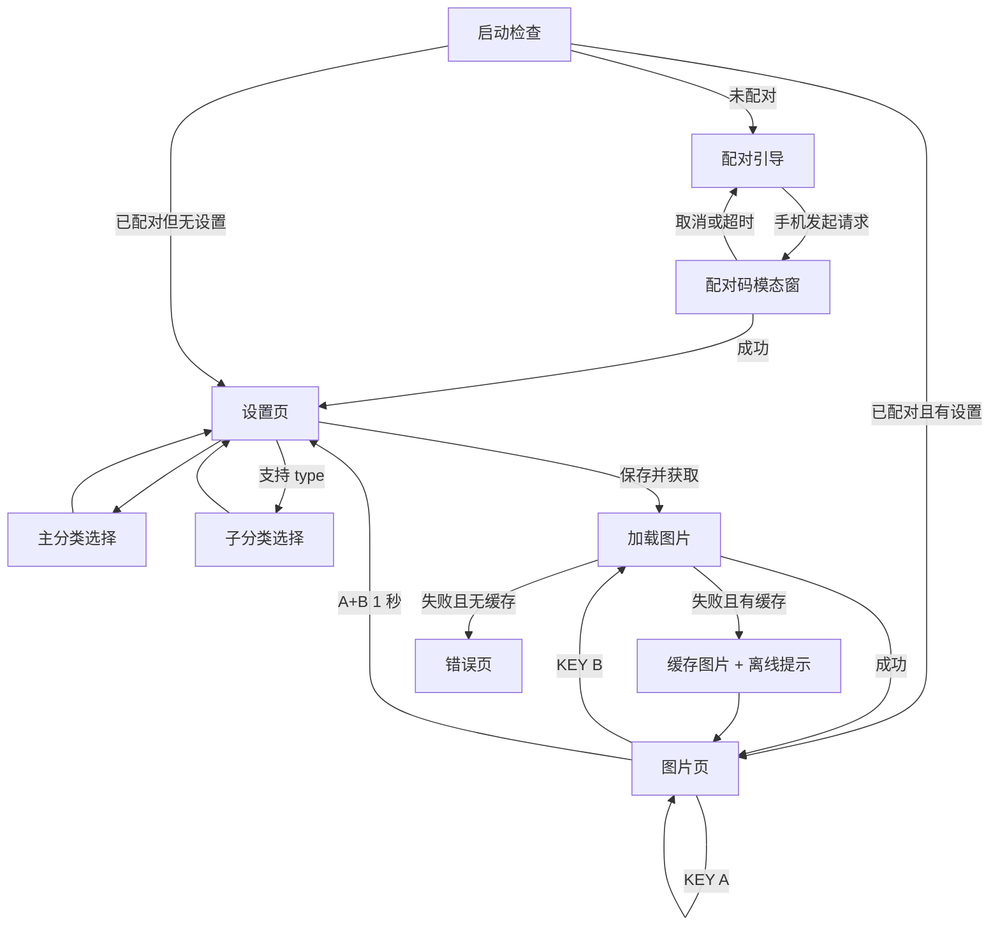

# Bajji StopWatch 随机图片 UI/UX 设计规格

- 日期：2026-08-20
- 状态：待用户审阅
- 设备：M5Stack StopWatch / 466×466 圆形 AMOLED / 触控 / KEY A + KEY B
- 基础规格：`2026-08-19-bajji-stopwatch-ble-ip-bridge-design.md`
- 接口：<https://uapis.cn/docs/api-reference/get-random-image>

## 1. 目标与边界

为 StopWatch 设计一套图片优先、可直接交付开发的圆屏 UI：

1. 首次启动检查配对状态，并引导未配对用户通过手机完成联网与配对。
2. 手机发起配对时，在设备端显示六位配对码。
3. 配对后允许用户在设备上设置并持久化随机图片接口的 `category` 与 `type`。
4. 获取并完整显示静态图与动态图。
5. KEY A 切换显示模式，KEY B 刷新图片，A+B 同时长按 1 秒返回设置页。

本设计不增加图片历史、收藏、账号、搜索、自定义 URL、定时刷新或复杂动画编辑器。接口与设备能力变化时再扩展。

## 2. 设计方向

采用“图片优先 + 暗色半透明控制层”。图片页尽量不覆盖内容；设置和状态层延续当前诊断界面的深色青蓝基调。

- 画布：466×466 px 圆形 Frame。
- 内容安全区：中心 328×328 px；文字、触控目标和关键状态必须留在安全区。
- 圆周外缘：只用于图片、模糊背景、装饰光晕和非关键进度。
- 触控目标：最小 48×48 px，行高优先使用 56 px。
- 反馈：触控或按键成功时提供短振动；错误时提供双短振动。
- 语言：首版中文；接口值以较小英文副标题显示，便于调试。

## 3. 视觉规范

### 3.1 色彩

| 用途 | 色值 |
| --- | --- |
| 基础背景 | `#05070C` |
| 实色表面 | `#0B1522` |
| 浮层表面 | `#101A27`，88% 不透明度 |
| 主强调色 | `#54D7FF` |
| 主文字 | `#F4F8FF` |
| 次文字 | `#A8B4C7` |
| 成功 | `#74E6A5` |
| 警告 | `#FFC857` |
| 错误 | `#FF6B76` |
| 遮罩 | `#05070C`，64% 不透明度 |

图片页的控件使用黑色半透明胶囊和白色文字，避免被图片主色吞没。所有状态不能只依赖颜色表达。

### 3.2 字体

- 中文：Source Han Sans SC。
- 数字、配对码和英文接口值：Montserrat。
- 页面标题：24 px / Semibold。
- 正文：18 px / Regular，行高 26 px。
- 辅助文字：14 px / Medium，行高 20 px。
- 配对码：56 px / Semibold / 8% 字距，使用等宽数字布局。
- 图片模式提示：16 px / Semibold。

### 3.3 形状与层级

- 设置卡片：24 px 圆角，1 px `#FFFFFF14` 描边。
- 按钮：全宽 56 px 高，28 px 圆角。
- 模态窗：安全区内 304 px 宽，32 px 圆角，背景模糊 20 px。
- 浮层阴影：`0 12 32 #00000052`。
- 图片页提示默认 1.2 秒后淡出，不长期遮挡图片。

## 4. 信息架构与状态流

配对成功且已有本地设置时直接进入图片页；首次配对成功但没有本地设置时进入设置页。启动时有缓存图片就立即显示缓存，再在后台检查连接状态，避免黑屏等待。

## 5. 页面与状态

### 5.1 启动检查

- 中央显示简化 Bajji 标记和环形扫描动效。
- 文案依次为“正在启动”“正在检查配对”。
- 检查完成立即进入下一状态，不显示可操作按钮。
- 启动失败时显示错误摘要和“长按 A+B 进入设置”提示；详细诊断仍留在内部工具页。

### 5.2 未配对引导

- 顶部状态胶囊：“未配对”。
- 中央使用手机与手表的连接示意图。
- 主标题：“请先连接手机”。
- 两步说明：
  1. 在手机打开 Bajji。
  2. 保持手机联网并选择这台设备。
- 底部动态状态：“正在等待配对请求…”并显示 BLE 广播波纹。
- 无需设备端确认按钮；KEY A/B 单按不执行操作。

### 5.3 配对码模态窗

- 背景保留未配对页并加 64% 暗色遮罩。
- 模态标题：“在手机输入配对码”。
- 六位数字按 `123 456` 分组显示，减少误读。
- 辅助文案：“仅接受你正在连接的手机”。
- 底部状态：“等待手机确认…”；配对进行中不允许关闭模态窗。
- 成功：码区变为绿色对勾，显示“配对成功”约 800 ms 后进入设置页。
- 取消、失败或超时：短错误反馈后返回未配对页，并生成新码等待下一次请求。

### 5.4 设置主页

安全区内使用纵向布局：

1. 标题“图片设置”和连接状态点。
2. 主分类行：中文名称 + 接口值。
3. 子分类行：仅当所选主分类支持 `type` 时显示。
4. 主按钮：“保存并获取图片”。
5. 底部提示：“设置保存在设备本地”。

默认值使用需求示例：`category=bq`、`type=eciyuan`。保存成功后立即持久化参数并请求图片；请求失败不回滚已保存参数。

### 5.5 主分类选择

使用全屏滚动列表，不使用拥挤的圆屏下拉菜单。选项为：

- 全部随机：省略 `category`；
- 动漫：`acg`；
- 风景：`landscape`；
- 综合动漫：`anime`；
- 电脑壁纸：`pc_wallpaper`；
- 手机壁纸：`mobile_wallpaper`；
- 动漫图库：`general_anime`；
- AI 绘画：`ai_drawing`；
- 表情包：`bq`；
- Furry：`furry`。

顶部固定标题和返回按钮；当前值显示青色勾选。选择后立即返回设置主页，但只有点击“保存并获取图片”才持久化。

### 5.6 子分类选择

子分类按主分类动态生成：

- `bq`：`xiongmao`、`waiguoren`、`maomao`、`ikun`、`eciyuan`；
- `acg`：`pc`、`mb`；
- `furry`：`z4k`、`szs8k`、`s4k`、`4k`。

其他主分类不支持 `type`，设置主页隐藏该行，同时清除尚未保存的旧 `type`，避免形成无效请求。

### 5.7 加载图片

- 如果已有图片，继续显示旧图，并在中央显示小型“正在换一张…”胶囊。
- 如果没有图片，显示深色背景、环形进度和“正在获取图片”。
- 不显示虚假的百分比；只表达进行中状态。
- 下载完成后以 180 ms 淡入替换，动态图从首帧开始播放。

### 5.8 图片页

- 图片覆盖整个圆屏，默认不显示永久工具栏。
- 底部安全区短暂显示：“A 效果 · B 换一张 · A+B 设置”。
- 顶部仅在状态变化时显示网络/缓存提示；正常在线时自动隐藏。
- 动态图首次加载时短暂显示“动态图”胶囊，随后隐藏；Figma 用连续关键帧示意播放。

KEY A 在以下模式间循环：

1. 裁切铺满：保持比例、居中裁切，默认模式。
2. 完整显示：前景完整显示；背景使用同图高斯模糊并裁切铺满。
3. 平铺：保持图像原始比例重复铺满圆屏。

每次切换在中央显示 1.2 秒模式名称。当前模式本地持久化，下次启动继续使用。

KEY B：立即请求新图片。进行中再次按 B 不创建并发请求，只给出轻振动和现有加载提示。

A+B 同时按下：中心出现 1 秒环形进度和“继续按住以打开设置”；任一按键提前释放即取消。完成后振动一次并进入设置主页。

### 5.9 弱网、离线与错误

- 有缓存：继续显示最后成功图片，顶部短暂显示“离线 · 显示缓存”；恢复网络后不自动换图，避免打断观看。
- 无缓存：错误页显示“图片暂时不可用”和“按 B 重试”。
- 参数无结果：提示“这个分类暂无图片”，按 B 可重试，A+B 可返回设置。
- 解码失败或不支持格式：保留旧图并显示“图片格式暂不支持”。
- 配对丢失：继续显示缓存图；状态提示“等待手机连接”，不强制离开图片页。

## 6. 静态图与动态图

- 静态图：JPEG、PNG、静态 WebP 使用相同的三种显示模式。
- 动态图：GIF、动态 WebP 在图片页循环播放；模式切换应用于所有帧。
- 解码或内存不足时保留最后完整帧，显示非阻塞错误提示，不清空当前图片。
- Figma 视觉稿用 3 个连续帧展示动态图变化，并用 Prototype 的 After Delay 模拟循环。

## 7. Figma 文件结构

新建文件 `Bajji StopWatch · Random Image UX`，包含以下页面：

1. `00 Cover`：项目说明、设备规格、交付索引。
2. `01 User Flow`：完整状态流与 A/B 按键规则。
3. `02 Foundations`：圆屏安全区、颜色、字体、间距、图标和阴影。
4. `03 Components`：状态胶囊、设置行、主按钮、列表项、配对模态窗、加载提示、按键提示和长按进度。
5. `04 Screens`：全部页面和关键状态，按主流程从左到右排列。
6. `05 Display Modes`：同一张横图、竖图、方图在三种模式下的对照。
7. `06 Motion & Handoff`：动态图关键帧、转场时长、按键行为和开发标注。

Figma 组件采用 Auto Layout；重复元素做成组件和必要的状态变体。屏幕 Frame 统一命名为 `StopWatch / <Flow> / <State>`。

## 8. Figma 屏幕清单

至少交付以下 18 个 466×466 屏幕：

1. 启动检查；
2. 未配对引导；
3. 配对码等待；
4. 配对成功；
5. 设置主页；
6. 主分类列表；
7. 子分类列表；
8. 首次加载；
9. 裁切铺满；
10. 完整显示 + 模糊背景；
11. 平铺；
12. 模式切换提示；
13. 刷新中；
14. A+B 长按 50%；
15. A+B 长按完成；
16. 离线缓存；
17. 无缓存错误；
18. 动态图播放示意。

## 9. 原型交互

Figma 原型用屏幕外的 `KEY A`、`KEY B` 热区模拟实体键：

- 点击 `KEY A`：三种模式循环。
- 点击 `KEY B`：进入刷新中，再进入下一张图片。
- 点击 `A+B Hold`：展示 50% 与完成状态，再返回设置页。
- 点击设置行：进入对应列表。
- 点击主按钮：保存、加载、进入图片页。
- 配对请求由“模拟手机发起配对”热点触发。

Figma 无法真实识别两枚实体键同时长按；原型只模拟结果，开发标注明确实际状态机为“两个键同时保持 1000 ms，提前释放取消”。

## 10. 验收标准

- 所有关键文字和触控目标位于 328×328 安全区。
- 配对码在圆屏上可一眼识别，无字体裁切。
- `category/type` 联动与接口支持范围一致。
- 三种图片模式使用同一素材即可直接比较。
- 静态图、动态图、加载、缓存、断网、无结果、解码失败均有对应状态。
- A、B、A+B 的单按、刷新中重复按和提前释放行为均有标注。
- 图片页正常状态不被永久工具栏遮挡。
- 字体明确使用 Source Han Sans SC 与 Montserrat，不回退为 Inter。
- 组件、变量和屏幕命名可供开发直接定位。
